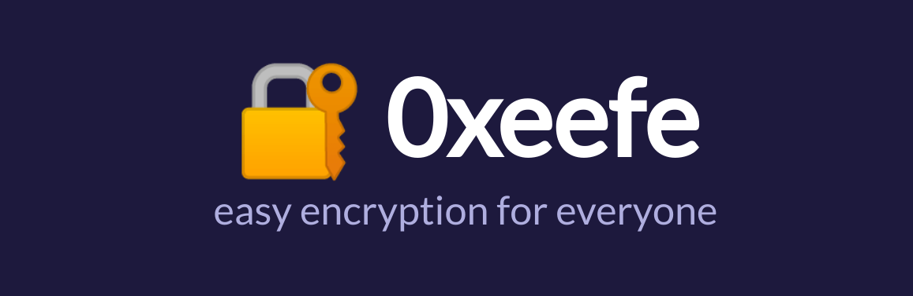
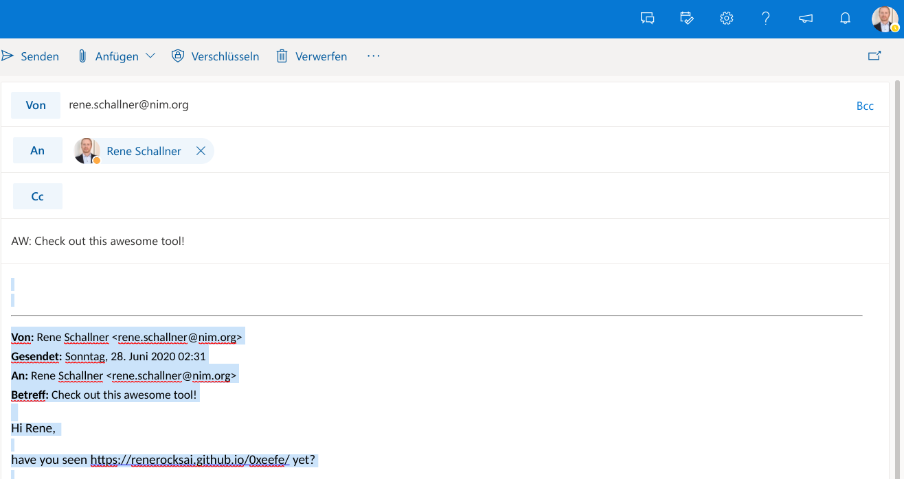
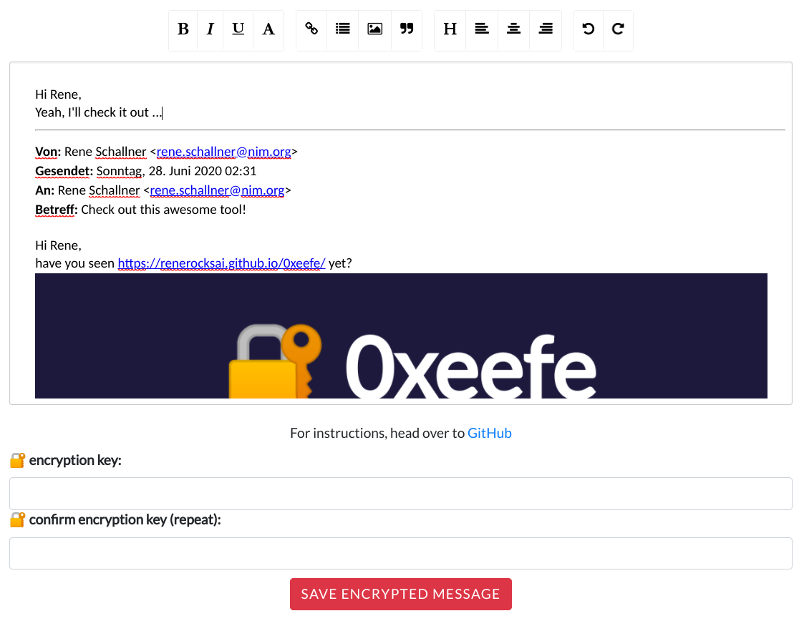
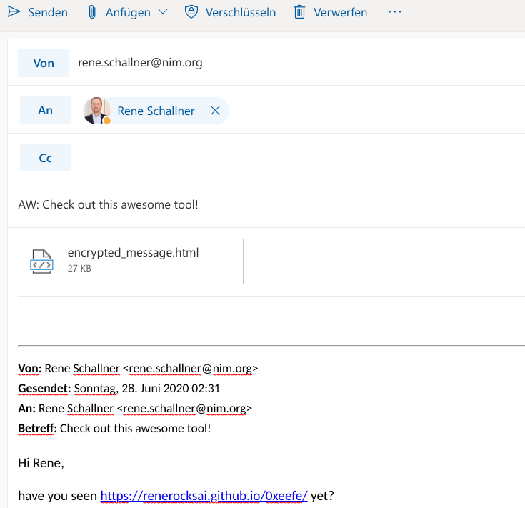

# 🔐 easy encryption for everyone

- Runs entirely in your browser
- No data leaves your browser **ever**!
    - only the encrypted message, when it is stored on your harddisk or mobile device, in the downloads folder of your browser.
- just try it at [https://renerocksai.github.io/0xeefe](https://renerocksai.github.io/0xeefe)
- no need to trust me!
    - have it audited!
    - check out the source code yourself!
- Encrypted messages are: encrypted. They are not just password-protected. So anyone receiving your message will not be able to bypass the "password check".

**Pro tip:** Use an [incognito browser window](https://support.google.com/chrome/answer/95464?co=GENIE.Platform%3DDesktop&hl=en) to prevent plugins from reading your private messages!

# Contents

1. [Motivation](#motivation)
2. [How to use it for e-mail?](#how-to-use-it-for-e-mail)
3. [How does the encryption work?](#how-does-the-encryption-work)

# Motivation
Since the introduction of the **[Lawful Access to Encrypted Data Act](https://www.judiciary.senate.gov/press/rep/releases/graham-cotton-blackburn-introduce-balanced-solution-to-bolster-national-security-end-use-of-warrant-proof-encryption-that-shields-criminal-activity#:~:text=The%20Lawful%20Access%20to%20Encrypted%20Data%20Act%20would%20bring%20an,devices%2C%20platforms%2C%20and%20systems.&text=This%20type%20of%20%E2%80%9Cwarrant%2Dproof,the%20internet%20for%20illicit%20purposes.)** I trust no encryption that is managed, i.e. where keys are stored in the cloud.

Quoting [bitcoin.com](https://news.bitcoin.com/lawful-access-to-encrypted-data-act-backdoor/):
> US lawmakers have introduced the Lawful Access to Encrypted Data Act to ensure law enforcement can access encrypted information. This bill is “a full-frontal nuclear assault on encryption in the United States,” one expert says. It requires manufacturers of encrypted devices and operating systems to have the ability to decrypt data upon request, creating a backdoor requirement.

The only way to ensure personal privacy is to take encryption into your own hands. Unfortunately, technical hurdles exclude the not-so-technical pleople from their right to privacy. This is where [0xeefe](https://renerocksai.github.io/0xeefe/) comes in. It is a really easy way to strongly encrypt your private communication. There is no software to install, no key pairs to generate and import, no key servers to maintain. How you manage your encryption keys / passwords is entirely up to you. You might want to remember them all, or have them stored on a secure USB device - or in a secure password manager (like 1Password). Creating encrypted messages doesn't get simpler than that :smile:.

# How to use it for e-mail?
Use your e-mail client. I use the webmail version of Outlook.

- I hit reply on an e-mail
- instead of replying there, I just select everything with CTRL + A and copy it:
  -   
  -   

- then I head over to [0xeefe](https://renerocksai.github.io/0xeefe/), paste with CTRL + C, and type my reply there, if I haven't already
  - 
- I enter the encryption key, twice
- hit "save encrypted message"
- and attach the downloaded encrypted message to my e-mail in Outlook
  - 
- that's it! ready to send that encrypted e-mail!

# How does the encryption work?
This tool uses the [CryptoJs](https://code.google.com/p/crypto-js/) library for the actual encryption. First, a stronger encryption key is derived from the one you input using PBKDF2 and a random salt with 100 rounds. Then the HTML is encrypted using AES256.

Encrypted messages are: encrypted. They are not just password-protected. So anyone receiving your message will not be able to bypass the "password check".

# To-do
- [ ] might turn this into a browser plugin
- [ ] automatically convert all pasted images to data URLs so they get encrypted, too
    - since images inserted into web mail clients typically get turned into magic URLs anyway, this is not the greatest of concerns at the moment.
